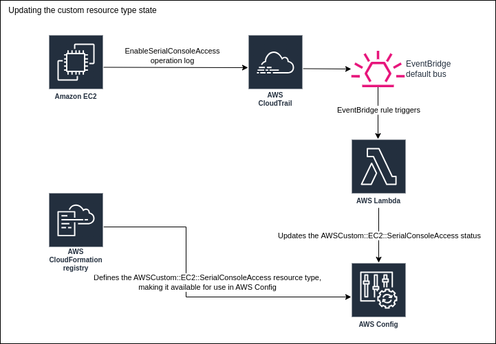
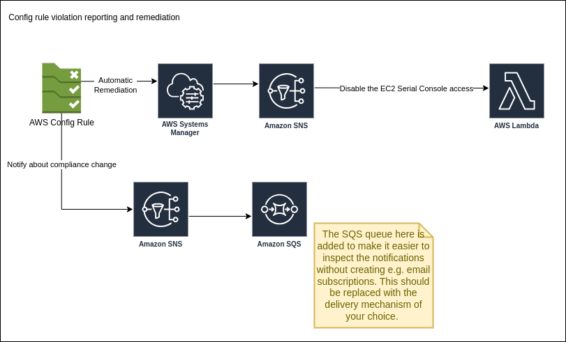

# Controlling EC2 Serial Console Access AWS Account Setting With AWS Config

## Introduction

This is a proof of concept implementation that ensures that the [EC2 Serial Console Access](https://docs.aws.amazon.com/AWSEC2/latest/UserGuide/configure-access-to-serial-console.html#serial-console-account-access)
setting stays disabled by using AWS Config together with a custom [CloudFormation Resource Type](https://docs.aws.amazon.com/cloudformation-cli/latest/userguide/resource-types.html),
CloudTrail, EventBridge and a bunch of Lambdas. The general idea is based on [this blog post](https://aws.amazon.com/blogs/mt/using-aws-config-custom-resources-to-track-any-resource-on-aws/).

The solution is implemented in [AWS CDK in Python](https://docs.aws.amazon.com/cdk/v2/guide/work-with-cdk-python.html).
The default project structure is modified to use
[Poetry](https://python-poetry.org/) with the `src/` layout instead of the
virtualenvs and requirements.txt.

## Preconditions and assumptions

It is assumed that AWS Config is enabled and recording all resource types. AWS
CloudTrail trail should also be configured prior to setting up the stack. The
stack itself should perform simple checks to verify if those two are enabled,
but doesn't inspect their configuration in detail.

It is assumed that a single region solution is enough, deploying it to multiple
regions is out of scope of that implementation.

## How it works?

AWS Config allows you to make sure that your resources are configured in a
certain way. Unfortunately, the EC2 Serial Console Access setting seems not to
have a resource describing its state in AWS Config yet. In order to add a
support for that, a custom CloudFormation Resource Type can be created, that
will describe the schema of such objects and make them available to AWS Config.
Such resources don't necessarily have to be instantiable by CloudFormation
(that is implement the necessary create, update, delete handlers) - in this
case that is not needed and a simple schema is enough.

Once we have the resource type that we can use with AWS Config, we need to make
sure its state in AWS Config is in sync with its actual state. This is achieved
by creating a rule in the EventBridge that will act on CloudTrail events that
describe changes to the Serial Console Access. It is not expected for this
setting to change frequently, so additionally the rule will trigger once a day
to eventually get the resource state in AWS Config in sync.



Given the resource in AWS Config, we can work on the remediation and
notifications. A [policy rule](https://docs.aws.amazon.com/config/latest/developerguide/evaluate-config_develop-rules_cfn-guard.html)
is created to make sure the Serial Console is disabled. The compliance status
change is sent as a notification to an SNS topic. An SQS queue is subscribed to
it to make it easier to demo that part of the system - it can be easily
replaced with email subscriptions or any other notification mechanism of your
choice. Auto remediation is configured with the SSM target of publishing a
notification to an SNS topic. A lambda responsible for disabling the Serial
Console access is subscribed to it.



## Quick Start

You will need the AWS CDK CLI installed (see the [guide](https://docs.aws.amazon.com/cdk/v2/guide/getting_started.html)). Please make sure it is functional by running:
```
cdk --version
```

Run `aws sts get-caller-identity` to make sure you are using the AWS account
you intended. You will need [AWS CLI](https://docs.aws.amazon.com/cli/latest/userguide/getting-started-install.html).

As described earlier, AWS Config and CloudTrail have to be enabled. 1-click setups from the console should be good to go.

Hop into the `cdk` folder inside this repo and run:
```
poetry shell
```
followed by
```
poetry install
```
This requires [poetry](https://python-poetry.org/) and [Python](https://www.python.org/).

Run:
```
cdk list
```
to see the available stacks. You might see some Docker related logs, those are
safe to ignore. Yes - you will need [docker](https://www.docker.com/) too. It
is used to bundle the lambdas and the CloudFormation custom resource type.

The CDK has to be bootstrapped on the AWS account. If you haven't done that already, run:
```
cdk bootstrap
```

Finally, to deploy the stack by running:
```
cdk deploy SerialconsoleConfigStack
```

Once deployed, you can test the solution:
- go to https://console.aws.amazon.com/ec2/ then Settings (lowest on the tab on the left) -> EC2 Serial Console. Grant access.
- go to https://console.aws.amazon.com/config/ and find the rule responsible for the Serial Console access. You should see it transition to non compliant after a while (please do refresh).
- go back to the EC2 Settings and see the EC2 Serial Console becoming disabled again. The rule in Config should transition to compliant again.

## Known limitations or possible improvements

- AWS Config updates and automatic remediation takes some time, up to a few
  minutes of latency is to be expected.
- The resources supporting resource access policies (such as the SQS queues,
  SNS topics and Lambdas) could be locked down, to make sure that identities
  with broad permissions can't access them at will.
- Some of the resources (such as IAM roles) are not tagged by default, making
  it harder to figure out what entity created them. An aspect can be applied to
  tag all resources consistently.
- There is no monitoring configured on the Dead Letter Queues.
- The bundling Docker image for the CloudFormation custom resource type is
  rebuilt each time, changing the asset hash of the schema package. This can be
  fixed by using a custom hash or a pre-built image.
